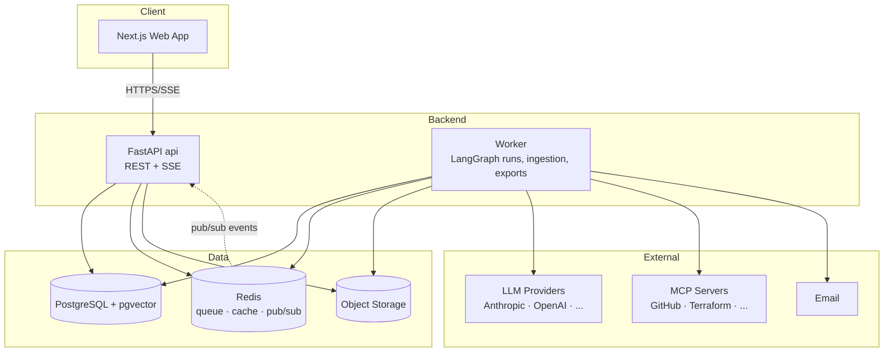

# 04 — System Architecture

## 1. Overview

The system is a **modular monolith** deployed as **three runtime processes** built from two
codebases:

1. **`api`** (Python/FastAPI) — synchronous HTTP + SSE. Auth, CRUD, run control, exports,
   MCP registry. Stateless.
2. **`worker`** (same Python codebase, different entrypoint) — executes agent runs
   (LangGraph), document ingestion, PDF rendering, email. Consumes jobs from Redis. Stateless;
   run state checkpoints in Postgres.
3. **`web`** (Next.js/TypeScript) — the SaaS frontend. Server components for shell/data,
   client components for chat, run progress, and the React Flow canvas.

Backing services: **PostgreSQL** (+ pgvector) as the system of record, **Redis**
(job queue, cache, SSE pub/sub fan-out), **S3-compatible object storage** (uploads, exports,
rendered images), external **LLM providers**, and external **MCP servers**.



## 2. ADR-001 — Modular Monolith over Microservices

**Status:** Accepted.

**Context.** Team of 1–3 engineers building a new product whose domain boundaries are still
being discovered. The workload has one genuinely different runtime profile: long-running,
LLM-bound agent runs vs short-lived HTTP requests.

**Decision.** One Python codebase, strictly modularized by domain (below), deployed as two
processes (`api`, `worker`). Not microservices.

**Rationale.**
- *Microservices tax we avoid:* N repos/pipelines, inter-service auth, distributed transactions,
  contract drift, distributed debugging — a tax paid in operations headcount we don't have.
- *The one real scaling asymmetry* (HTTP vs long jobs) is solved by the two-process split; each
  scales independently (HPA vs queue-depth autoscaling) without any network boundary between
  domains.
- *Wrong-boundary risk:* premature service boundaries around a still-moving domain are the most
  expensive microservice mistake; module boundaries are cheap to refactor, network boundaries
  are not.
- *DDD is preserved:* modules communicate only through their public application services and
  domain events — the same discipline microservices force, without the network.

**Extraction seams (documented now, exercised later).** Candidates, in likely order:
1. **Diagram/PDF rendering** (CPU-bound, stateless) — trivial extraction.
2. **Ingestion/embedding pipeline** (bursty) — already queue-isolated.
3. **Agent runtime** (if we later sandbox untrusted tools per-run) — LangGraph state is already
   externalized to Postgres, so it moves cleanly.

**Enforcement.** `import-linter` contracts forbid cross-module imports except via each module's
`application` package; domain events go through an in-process event bus with a queue-backed
implementation, so moving a consumer out-of-process is a config change.

**Revisit triggers:** > ~8 backend engineers; a module needing a different language/runtime;
compliance demanding isolation (e.g., credential vault as its own service).

## 3. Backend Modules (DDD bounded contexts)

```
backend/src/
├── shared/          # kernel: Result types, ULIDs, event bus, errors, config, DI container
├── identity/        # users, workspaces, memberships, roles, API keys
├── projects/        # projects, settings, requirements documents
├── conversations/   # chat threads, messages, uploads
├── orchestration/   # runs, LangGraph graphs, agent definitions, budgets, checkpoints
├── artifacts/       # artifact types, versions, dependency graph, staleness, diffs
├── knowledge/       # RAG: corpora, chunks, embeddings, retrieval
├── integrations/    # MCP registry, tool governance, approvals, LLM provider adapters
├── metering/        # usage records, quotas, plan enforcement
├── notifications/   # in-app + email
└── platform/        # FastAPI app, routers, middleware; worker entrypoint; composition root
```

Each module follows the same internal layering (dependencies point inward):

```
<module>/
├── domain/         # entities, value objects, domain events, domain services — no I/O
├── application/    # use cases (commands/queries), ports (Protocol interfaces)
├── infrastructure/ # SQLAlchemy repos, Redis adapters, provider clients
└── api/            # FastAPI router + Pydantic request/response schemas
```

**Dependency injection:** a composition root in `platform/` wires ports to adapters
(`dishka` or `punq`-style container; constructor injection only; FastAPI `Depends` used solely
at the edge). Domain and application layers import zero frameworks — SOLID's DIP applied
literally, which is what makes them unit-testable without infrastructure.

**Type safety:** Pydantic models at boundaries (API, LLM structured output, MCP payloads);
plain typed dataclasses inside the domain; mypy `--strict` everywhere.

## 4. Key Data Flows

### 4.1 Blueprint run
1. `POST /projects/{id}/runs` → api validates quota/plan, creates `runs` row (`queued`),
   enqueues job, returns `run_id`.
2. Worker picks job → loads requirements + project settings + RAG context → executes the
   LangGraph graph (doc 07). After each node: checkpoint to Postgres, emit events to Redis
   pub/sub, write `agent_events` rows.
3. api's SSE endpoint subscribes to the run's channel and relays events to the browser.
   Reconnect uses `Last-Event-ID` → missed events are replayed from `agent_events`.
4. Artifacts are written as new versions; run marked `completed`; notification emitted.

### 4.2 Human-in-the-loop pause
Graph reaches a node needing input (clarification or MCP approval) → run state `needs_input`,
checkpoint saved, worker releases the job. User responds via API → api validates, enqueues a
**resume job** → any worker resumes from the checkpoint. No worker ever blocks waiting on a human.

### 4.3 Document ingestion
Upload → api stores file in S3, creates `documents` row, enqueues ingestion → worker extracts,
chunks, embeds (LLM provider), writes `chunks` with vectors → status `ready`, event to UI.

## 5. Frontend Architecture

- Next.js App Router; feature-folder structure mirroring backend contexts
  (`features/projects`, `features/runs`, `features/diagram`, ...).
- Server Components + route handlers proxy to the backend (browser never calls FastAPI
  directly → single origin, httpOnly cookie auth, no CORS surface).
- State: TanStack Query for server state; Zustand only for canvas/UI state.
- Generated API client from the backend OpenAPI spec (CI job) — no hand-written fetch types.
- React Flow canvas renders the canonical diagram JSON; exports happen server-side for fidelity.

## 6. Cross-Cutting Concerns

| Concern | Approach |
|---|---|
| Configuration | pydantic-settings; 12-factor env vars; no config files in images |
| Errors | RFC 9457 problem+json (doc 06); typed domain errors mapped at the edge |
| Events | Domain events (in-process bus) → outbox table → queue for async consumers |
| Idempotency | `Idempotency-Key` header on mutating endpoints; job idempotency keys |
| Time & IDs | UTC everywhere; ULIDs (sortable, no coordination) |
| Migrations | Alembic, one head, expand/contract only, CI check for drift |
