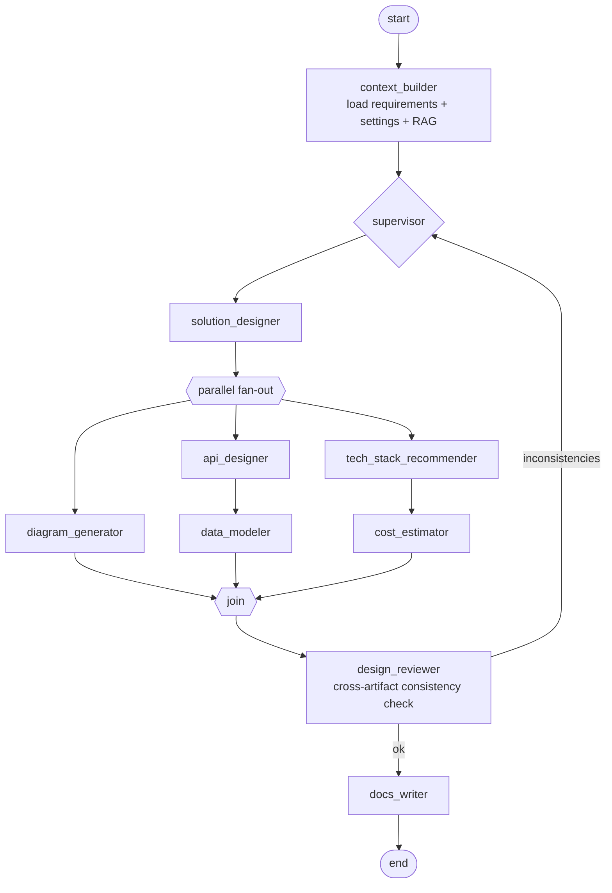

# 07 — Agent Architecture

## 1. Framework Roles

- **LangGraph** owns *control flow*: the orchestration graph, conditional routing, parallel
  fan-out, checkpointing (Postgres), and human-in-the-loop interrupts.
- **PydanticAI** owns *individual agents*: each specialist is a PydanticAI agent with a typed
  output schema, so every agent boundary is a validated Pydantic model — malformed LLM output
  is retried at the agent layer and never leaks into the graph.
- **LLMService port** (our abstraction) sits beneath PydanticAI's model interface: provider
  routing, BYOK keys, model tiering, retries/failover, token accounting, prompt caching.

## 2. Orchestration Graph (blueprint run)

- `solution_designer` runs first because every other artifact depends on the architecture.
- `diagram`, `tech_stack`, and the `api → db` chain run **in parallel** (NFR-1: run time).
- `design_reviewer` is a cheap high-leverage step: it validates cross-artifact consistency
  (every diagram component appears in the architecture doc; API entities exist in the schema;
  cost estimate covers every infrastructure component). At most **2 repair loops**, then it
  annotates remaining inconsistencies in the design doc instead of looping forever.
- Every node: checkpoint → emit events → update `tokens_used`. The **budget guard** wraps every
  LLM call; exceeding the run budget raises `BudgetExceeded`, the graph ends gracefully with
  completed artifacts kept.

A second, smaller graph handles **intake** (requirements_analyst ⇄ human, interrupt-based), and
a third handles **provisioning** (plan → human approval interrupt → execute via MCP → report).

## 3. Specialist Agents

| Agent | Input (typed) | Output (typed) | Tier | Notes |
|---|---|---|---|---|
| requirements_analyst | idea text, uploads, answers | `RequirementsDoc`, `list[ClarifyingQuestion]` | quality | max 5 questions/round, 3 rounds; records assumptions |
| solution_designer | `RequirementsDoc`, RAG context | `ArchitectureDesign` (components, flows, decisions+rationale) | quality | cites requirement IDs |
| diagram_generator | `ArchitectureDesign` | `DiagramSpec` (our canonical JSON, C4-ish views) | fast | deterministic layout pass post-LLM |
| tech_stack_recommender | design + team skills/constraints | `TechStackRecommendation` (choice, alternatives, trade-offs) | quality | grounded in RAG pattern catalog |
| cost_estimator | design + stack + scale params | `CostEstimate` (line items, low/expected/high) | fast | prices from our versioned pricing dataset (RAG), not model memory |
| api_designer | design | OpenAPI 3.1 document | quality | output validated by OpenAPI parser, not just schema |
| data_modeler | design + API spec | `DbSchema` (DDL + ERD) | quality | DDL validated by `sqlglot` parse |
| design_reviewer | all artifacts | `ConsistencyReport` (issues, target agent per issue) | quality | drives repair loop |
| docs_writer | all artifacts | `DesignDocument` (markdown) | fast | assembles, doesn't invent |
| provisioner | user goal + MCP tool catalog | `ProvisioningPlan` (ordered tool calls) | quality | never executes; execution is a separate governed step (doc 08) |

**Agent definition standard** (every agent, enforced by a base class):
- System prompt versioned in-repo (`prompts/<agent>/<semver>.md`); prompt version recorded in
  artifact provenance — reproducibility and A/B testing depend on this.
- Typed `deps` (injected services: retriever, pricing data, clock) and typed `output`.
- Self-declared token ceiling and model tier (overridable per workspace).
- No agent talks to another agent directly; **all communication flows through graph state**
  (typed `RunState` Pydantic model). This keeps agents independently testable and swappable.

## 4. State & Memory

- `RunState`: requirements, project settings, accumulated artifacts, consistency issues,
  token ledger, event seq. Serialized in LangGraph checkpoints (Postgres).
- Conversation memory = thread messages (DB), summarized into intake context when long
  (rolling summary node) — no vendor "memory" features, portability preserved.
- Long-term knowledge = RAG corpora only. Agents never share hidden state.

## 5. Failure Policy

| Failure | Handling |
|---|---|
| LLM transient error / rate limit | retry ×3 exponential backoff → provider failover chain |
| Structured-output validation failure | PydanticAI retry with error feedback ×2 → agent marked failed |
| Agent failed after retries | run continues; artifact marked `failed`; user can retry single artifact |
| Worker crash mid-run | job re-delivered; resume from last checkpoint (idempotent nodes) |
| Budget exceeded | graceful stop, partial results kept, run status `failed:budget` |
| Content policy refusal | surfaced verbatim to user; run `failed:refused`, no retry |

## 6. Evaluation (summary; detail in doc 12)

Golden-set eval harness: ~30 reference project briefs → run graph → score with (a) deterministic
checks (valid OpenAPI, parseable DDL, diagram JSON schema, all components costed) and
(b) LLM-as-judge rubric (completeness vs requirements, soundness, consistency). Runs nightly
and on any prompt/model/graph change; regression gate for prompt merges.
